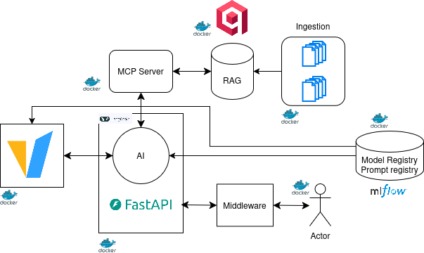

<div align="center">

# 🔩 TechLogic AI Assistant

### Production-Ready · Fully Local · Hybrid RAG · Agentic AI

> An **enterprise-grade AI chatbot** embedded in a company website for *TechLogic S.p.A.*,  
> a precision metal parts manufacturer based in Milan, Italy.  
> Built on a microservices architecture — **no cloud, no API keys, your data never leaves your hardware.**

<br/>


<br/>



<br/>

</div>

---

## 📚 Table of Contents

- [📖 About](#-about)
- [✨ Key Features](#-key-features)
- [✨ Example questions](#-example-questions)
- [🏗️ Architecture](#%EF%B8%8F-architecture)
  - [Request Flow](#request-flow)
- [🛠️ Tech Stack](#%EF%B8%8F-tech-stack)
- [📁 Project Structure](#-project-structure)
- [⚙️ Services Deep Dive](#%EF%B8%8F-services-deep-dive)
  - [🏗️ Infrastructure](#%EF%B8%8F-infrastructure-always-on)
  - [🔧 Setup Jobs](#-setup-jobs-run-once-then-exit)
  - [🚀 Application Layer](#-application-layer)
- [🚀 Getting Started](#-getting-started)
- [🔧 Configuration Reference](#-configuration-reference)
- [📡 API Reference](#-api-reference)
- [📚 Knowledge Base](#-knowledge-base)
- [📊 MLflow Prompt Registry](#-mlflow-prompt-registry)
- [🔍 RAG Pipeline](#-rag-pipeline)
- [🌐 Frontend](#-frontend)
- [🛑 Stopping the Stack](#-stopping-the-stack)
- [🤝 Contributing](#-contributing)
- [📄 License](#-license)

---

## 📖 About

**TechLogic AI Assistant** is a fully **self-hosted RAG chatbot** that lets customers and internal staff query company information — products, processes, certifications, contacts, and FAQs — through a natural language interface powered by a local quantized LLM.

The chatbot is embedded as a **floating widget** in a React company website. It uses a **LangChain tool-calling agent** that retrieves context from a **Qdrant vector database** via the **Model Context Protocol (MCP)**, and streams responses back to the user in real time via Server-Sent Events.

The entire stack — from model weights to frontend — runs on-premise via Docker Compose with NVIDIA GPU inference.

---

## ✨ Key Features

- 🔒 **100% Local** — No data leaves your servers; all inference runs on your NVIDIA GPU
- 🧠 **Agentic Architecture** — LangChain agent with tool-calling via Model Context Protocol (MCP)
- 🔍 **Hybrid RAG** — Dense (BGE-small) + Sparse (BM25) retrieval with Reciprocal Rank Fusion via Qdrant
- 📊 **MLflow Integration** — Model registry, prompt versioning & production aliasing
- ⚡ **Streaming Responses** — Server-Sent Events (SSE) for real-time token streaming to the UI
- 💬 **Embedded Chat Widget** — Floating AI assistant built directly into the React SPA
- 🌐 **Multi-Page React App** — Home, Products, Quality Control, Company pages (React Router v7)
- 🚀 **Production Ready** — Rate limiting (SlowAPI), CORS, Docker health checks, graceful startup ordering
- 🔧 **Fully Configurable** — Pydantic Settings with clean environment variable overrides per service
- 📦 **Fast Python Packaging** — `uv` package manager per microservice for blazing-fast dependency resolution

---
## ✨ Example questions:
* Who founded the company?

* Can you give me the contact details?

* Can you tell me about your products?

* Can you tell me the company's history?

* Tell me more about the technology.

* Do you accept CAD as a file format?

---
## 🏗️ Architecture

<br/>

The system is organized into **three layers** orchestrated by Docker Compose:

| Layer | Services | Description |
|---|---|---|
| **Infrastructure** | `qdrant`, `mlflow`, `vllm` | Always-on data and inference backbone |
| **Setup Jobs** *(one-shot)* | `mlflow-app`, `ingestionrag` | Run once at first boot, then exit |
| **Application** | `mcpserver`, `app` | Runtime services that handle user requests |

### Request Flow

```
User types a message in the chat widget
        │
        ▼
 React SPA (frontend)
        │  POST /agent  {"prompt": "Do you make aluminum parts?"}
        ▼
 FastAPI Agent Service  (port 9997)
        │  Loads system prompt from MLflow at startup
        │  Creates LangChain agent with MCP tools
        │
        ├──► Tool Call: find_relevant_documents("aluminum parts")
        │           │
        │           ▼
        │    FastMCP Server  (port 8021)
        │           │  Hybrid Qdrant query (dense + sparse → RRF)
        │           ▼
        │    Qdrant Vector DB  (port 6333)
        │           │  Top-5 relevant document payloads
        │           ◄──────────────────────────────────
        │
        │  Context injected into LLM prompt
        ▼
 vLLM (Qwen2.5-7B-Instruct-GPTQ-Int4)  (port 8222)
        │  OpenAI-compatible streaming API
        ▼
 SSE token stream  →  Chat widget renders response in real time
```

---

## 🛠️ Tech Stack

<table>
<thead>
<tr>
  <th>Category</th>
  <th>Technology</th>
  <th>Role</th>
</tr>
</thead>
<tbody>
<tr>
  <td><b>LLM Runtime</b></td>
  <td>
    
    &nbsp;Qwen2.5-7B-Instruct-GPTQ-Int4
  </td>
  <td>Local GPU inference, tool-call parsing (Hermes)</td>
</tr>
<tr>
  <td><b>Agent Framework</b></td>
  <td>
    
    &nbsp;LangChain
  </td>
  <td>Tool-calling agent with SSE streaming</td>
</tr>
<tr>
  <td><b>Tool Protocol</b></td>
  <td>
    
  </td>
  <td>RAG retrieval tool exposed via Model Context Protocol</td>
</tr>
<tr>
  <td><b>API Framework</b></td>
  <td>
    
    &nbsp;+&nbsp;
    
  </td>
  <td>Streaming chat API with rate limiting (10 req/min)</td>
</tr>
<tr>
  <td><b>Vector Store</b></td>
  <td>
    
    &nbsp;+ FastEmbed
  </td>
  <td>Dense + sparse vectors, RRF fusion at query time</td>
</tr>
<tr>
  <td><b>Embeddings</b></td>
  <td>BAAI/bge-small-en-v1.5 · Qdrant/BM25</td>
  <td>384-dim dense vectors + sparse BM25 tokens</td>
</tr>
<tr>
  <td><b>MLOps</b></td>
  <td>
    
  </td>
  <td>Model reference, prompt versioning & aliasing</td>
</tr>
<tr>
  <td><b>Frontend</b></td>
  <td>
    
    &nbsp;
    
    &nbsp;
    
    &nbsp;
    
  </td>
  <td>Multi-page SPA with embedded AI chat widget</td>
</tr>
<tr>
  <td><b>Containerization</b></td>
  <td>
    
    &nbsp;Compose v2
  </td>
  <td>Full-stack orchestration with health checks</td>
</tr>
<tr>
  <td><b>Package Manager</b></td>
  <td>
    
    &nbsp;(Python) &nbsp;·&nbsp;
    
    &nbsp;(Node)
  </td>
  <td>Per-service Python envs + Node for frontend</td>
</tr>
<tr>
  <td><b>Validation</b></td>
  <td>
    
    &nbsp;Settings + Models
  </td>
  <td>Configuration and request/response validation</td>
</tr>
</tbody>
</table>

---

## 📁 Project Structure

```
techlogic-chatbot/
│
├── 📁 architecture/                     # System diagrams
│   ├── Architecture.drawio.png
│   └── Architecture.drawio.svg
│
├── 📁 docs/                             # Company knowledge base (RAG source)
│   ├── contacts.txt                     # Contact information
│   ├── faq.txt                          # Frequently asked questions
│   ├── process.txt                      # Manufacturing processes
│   ├── products.txt                     # Product catalogue & specs
│   ├── story.txt                        # Company history & values
│   └── technology.txt                   # Equipment & certifications
│
├── 📁 frontend/                         # React + Vite SPA
│   ├── index.html
│   ├── vite.config.js
│   ├── package.json
│   └── src/
│       ├── main.jsx                     # Router bootstrap (React Router v7)
│       ├── styles.css                   # Global styles (Tailwind)
│       └── routes/
│           └── App.jsx                  # All pages + ChatWidget component
│
├── 📁 src/                              # Backend microservices
│   ├── 📁 agent/                        # FastAPI streaming chat API
│   │   ├── Dockerfile
│   │   ├── main.py                      # /health + /agent SSE endpoints
│   │   ├── agent.py                     # LangChain agent initialization
│   │   ├── settings.py                  # Pydantic configuration
│   │   ├── validator.py                 # Request/response models
│   │   ├── pyproject.toml
│   │   └── uv.lock
│   │
│   ├── 📁 ingestionrag_service/         # Document embedding pipeline
│   │   ├── Dockerfile
│   │   ├── ingestion.py                 # Qdrant upsert (dense + sparse)
│   │   ├── settings.py
│   │   ├── pyproject.toml
│   │   └── uv.lock
│   │
│   ├── 📁 mcp_server_service/           # FastMCP RAG tool server
│   │   ├── Dockerfile
│   │   ├── main.py                      # find_relevant_documents tool (RRF)
│   │   ├── settings.py
│   │   ├── pyproject.toml
│   │   └── uv.lock
│   │
│   ├── 📁 mlflow_service/               # One-shot: model download + registry
│   │   ├── Dockerfile
│   │   ├── main.py                      # HF snapshot_download + prompt reg.
│   │   ├── settings.py
│   │   ├── pyproject.toml
│   │   └── uv.lock
│   │
│   └── 📁 qdrant_service/               # Qdrant custom Docker config
│       └── Dockerfile
│
├── 📁 models/                           # 🔒 LLM weights (gitignored)
│   └── main_model/                      # Auto-populated at first boot
│
├── 📁 local_models/                     # 🔒 HuggingFace cache (gitignored)
├── 📁 qdrant_data/                      # 🔒 Vector DB persistence (gitignored)
├── 📁 mlruns/                           # 🔒 MLflow tracking store (gitignored)
│
├── compose.yaml                         # Docker Compose orchestration
├── Makefile                             # Convenience CLI targets
├── .python-version                      # uv Python version pin
└── README.md
```

---

## ⚙️ Services Deep Dive

### 🏗️ Infrastructure (always-on)

| Service | Image | Ports | Notes |
|---|---|---|---|
| `qdrant` | Custom build | `6333` (HTTP), `6334` (gRPC) | On-disk payload, 4 GB memory limit |
| `mlflow` | `ghcr.io/mlflow/mlflow:latest` | `5001` → `5000` | SQLite backend, artifact serving enabled |
| `vllm` | `vllm/vllm-openai:latest` | `8222` → `8000` | Requires NVIDIA GPU; `--enable-auto-tool-choice --tool-call-parser hermes` |

> ⚠️ **vLLM flag note:** `--enable-auto-tool-choice` and `--tool-call-parser hermes` are **required** for the LangChain agent's tool-calling to work correctly with Qwen models.

### 🔧 Setup Jobs (run once, then exit)

| Service | Trigger | What It Does |
|---|---|---|
| `mlflow-app` | `depends_on: mlflow` healthy | Downloads `Qwen2.5-7B-Instruct-GPTQ-Int4` from HuggingFace Hub → saves to `./models/main_model`. Registers `main_prompt` (alias: `production`) and `rag_prompt` (alias: `rag`) in MLflow Prompt Registry. |
| `ingestionrag` | `depends_on: qdrant` healthy | Reads all `.txt` files from `./docs/` → embeds with FastEmbed (BGE-small dense + BM25 sparse) → upserts into Qdrant collection `small_metal_parts`. Recreates the collection on every run. |

### 🚀 Application Layer

| Service | Port | Rate Limit | Description |
|---|---|---|---|
| `mcpserver` | `8021` | — | FastMCP server. Exposes `find_relevant_documents` tool. Loads RAG prompt from MLflow at startup. Performs Qdrant hybrid query with RRF fusion. |
| `app` | `9997` | 10 req/min | FastAPI agent. Loads `main_prompt@production` from MLflow at startup. Creates a new LangChain agent per request. Streams tokens via SSE. |

---

## 🚀 Getting Started

### Prerequisites

| Requirement | Details |
|---|---|
| 🎮 **NVIDIA GPU** | CUDA-capable (RTX series recommended) 8 GB VRAM minimum|
| 🐳 **Docker Engine** | 24.0+ with Compose v2 (`docker compose`) |
| ⚡ **NVIDIA Container Toolkit** | [Install guide ↗](https://docs.nvidia.com/datacenter/cloud-native/container-toolkit/latest/install-guide.html) |
| 🤗 **HuggingFace Token** | With access to [Qwen2.5-7B-Instruct-GPTQ-Int4 ↗](https://huggingface.co/Qwen/Qwen2.5-7B-Instruct-GPTQ-Int4) |
| 💾 **Disk Space** | ~8 GB for model weights |
| 🧠 **RAM** | 16 GB minimum · 32 GB recommended |

---

### Step 1 — Clone

```bash
git clone https://github.com/DanielePioGenovese/chatbot.git
cd chatbot
```

### Step 2 — Configure environment

```bash
# Create .env at the project root
echo "HF_TOKEN=hf_your_token_here" > .env
```

> The `HF_TOKEN` is consumed by the `mlflow-app` setup job to authenticate the HuggingFace Hub model download.

### Step 3 — Build and launch the stack

```bash
make build_up

```
Docker Compose manages the startup order automatically via `depends_on` + `condition` directives:

```
Phase 1 — Infrastructure
  qdrant ──────────────► healthy
  mlflow ──────────────► healthy

Phase 2 — Setup Jobs (blocking, run once)
  mlflow-app ──────────► completed_successfully   (downloads model, registers prompts)
  ingestionrag ────────► completed_successfully   (embeds docs into Qdrant)

Phase 3 — Application
  vllm ────────────────► healthy
  mcpserver ───────────► healthy
  app ─────────────────► running
```

> ☕ **First boot takes 10–20 minutes** (model download ~8 GB). Subsequent starts are instant since weights are cached in `./models/`.

### Step 4 — Access the services

| Service | URL |
|---|---|
| 💬 **Chat API** | `http://localhost:9997/agent` |
| ✅ **API Health** | `http://localhost:9997/health` |
| 📊 **MLflow UI** | `http://localhost:5001` |
| 🔎 **Qdrant Dashboard** | `http://localhost:6333/dashboard` |
| 🤖 **vLLM API (OpenAI)** | `http://localhost:8222/v1` |
| 🔌 **MCP Server** | `http://localhost:8021/mcp` |
| 🌐 **Frontend** | Open `http://localhost:5173` in browser or serve with Vite |

### Step 5 — Launch the frontend (optional, for development)

```bash
cd frontend
npm install
npm run dev
# → http://localhost:5173
```

---

## 🔧 Configuration Reference

All services use **Pydantic Settings** — every value can be overridden with an environment variable.

### Agent (`src/agent/settings.py`)

| Variable | Default | Description |
|---|---|---|
| `TRANSPORT_SETTINGS` | `streamable_http` | MCP transport protocol |
| `URI_MCP_SERVER` | `http://mcpserver:8021/mcp` | MCP server endpoint |
| `URI_MLFLOW_SERVER` | `http://mlflow:5000` | MLflow tracking URI |
| `MODEL` | `main_model` | vLLM served model name |
| `URI_VLLM` | `http://vllm:8000/v1` | vLLM OpenAI-compatible base URL |
| `MFLOW_PROMPT_NAME` | `main_prompt` | Prompt name in MLflow registry |
| `MFLOW_PROMPT_ALIAS` | `production` | Prompt alias to load at startup |
| `TEMPERATURE` | `0.0` | LLM sampling temperature |
| `TIMEOUT` | `120` | Request timeout in seconds |
| `STREAMING` | `true` | Enable SSE token streaming |

### Ingestion (`src/ingestionrag_service/settings.py`)

| Variable | Default | Description |
|---|---|---|
| `CLIENT` | `http://qdrant:6333` | Qdrant connection URL |
| `COLLECTION_NAME` | `small_metal_parts` | Qdrant collection name |
| `DENSE_MODEL` | `BAAI/bge-small-en-v1.5` | Dense embedding model (FastEmbed) |
| `SPARSE_MODEL` | `Qdrant/bm25` | Sparse embedding model (BM25) |
| `DENSE_SIZE` | `384` | Dense vector dimensionality |
| `DOCS_PATH` | `/docs` | Document directory (container path) |

### MCP Server (`src/mcp_server_service/settings.py`)

| Variable | Default | Description |
|---|---|---|
| `QDRANT_HOST` | `qdrant` | Qdrant hostname |
| `QDRANT_PORT` | `6333` | Qdrant port |
| `HOST` | `0.0.0.0` | MCP server bind address |
| `PORT` | `8021` | MCP server port |
| `MLFLOW_PROMPT_NAME` | `rag_prompt` | RAG tool prompt name in MLflow |
| `MLFLOW_PROMPT_ALIAS` | `rag` | MLflow prompt alias |

### MLflow App (`src/mlflow_service/settings.py`)

| Variable | Default | Description |
|---|---|---|
| `MODEL_ID` | `Qwen/Qwen2.5-7B-Instruct-GPTQ-Int4` | HuggingFace model repository |
| `MLFLOW_URL` | `http://mlflow:5000` | MLflow tracking URI |
| `DST_PATH` | `/models/main_model` | Local model weight destination |
| `MAIN_PROMPT_NAME` | `main_prompt` | Agent system prompt name |
| `PROMPT_ALIAS` | `production` | Deployment alias for main prompt |
| `RAG_PROMPT_NAME` | `rag_prompt` | RAG tool description prompt name |
| `PROMPT_RAG_ALIAS` | `rag` | Deployment alias for RAG prompt |

---

## 📡 API Reference

### `GET /health`

Simple liveness check.

```bash
curl http://localhost:9997/health
# {"status": "ok"}
```

---

### `POST /agent`

Send a natural language query and receive a streamed response.

**Rate limit:** 10 requests / minute / IP address

**Request**

```bash
curl -X POST http://localhost:9997/agent \
  -H "Content-Type: application/json" \
  -d '{"prompt": "What materials do you work with for precision parts?"}'
```

**Request body schema**

```json
{
  "prompt": "string (1–4096 chars, required)"
}
```

**Response** — `text/event-stream` (Server-Sent Events)

```
data: {"answer": "TechLogic works with a range of precision materials"}
data: {"answer": " including stainless steel, aluminum alloys,"}
data: {"answer": " and brass for micro-turned components..."}
data: {"done": true}
```

**Error codes**

| Status | Meaning |
|---|---|
| `422` | Validation error (prompt too short/long) |
| `429` | Rate limit exceeded |
| `504` | Agent timeout (> 120 s) |
| `500` | Internal server error |

---

## 📚 Knowledge Base

The `docs/` directory is the single source of truth ingested into Qdrant at startup:

| File | Contents |
|---|---|
| `products.txt` | Product catalogue: micro fasteners, sensor bodies, zero-defect stock lines |
| `process.txt` | Manufacturing processes, CNC workflows, tolerance specifications |
| `technology.txt` | Equipment, laser-vision inspection systems, certifications |
| `faq.txt` | Frequently asked questions from customers |
| `contacts.txt` | Company contact details and support hours |
| `story.txt` | Company history, mission, and values |

### ➕ Adding or updating documents

Place new `.txt` files in `docs/` and re-run the ingestion service:

```bash
make ingest
```

> The ingestion service **deletes and recreates** the collection on every run, so all documents are always in sync.

---

## 📊 MLflow Prompt Registry

Prompts are versioned and aliased in MLflow, enabling **hot-swapping without container rebuilds**.

| Prompt Name | Alias | Consumed By | Purpose |
|---|---|---|---|
| `main_prompt` | `production` | `app` (agent service) | System instructions for the LangChain agent |
| `rag_prompt` | `rag` | `mcpserver` | Tool description for `find_relevant_documents` |

### Updating a prompt

```bash
# 1. Edit and register a new version via the MLflow UI
#    → http://localhost:5001  →  Prompts  →  main_prompt

# 2. Point the production alias to the new version
mlflow prompt set-alias main_prompt production <new_version_number>

# 3. Restart the agent service to pick up the change
make restart_app
```

---

## 🔍 RAG Pipeline

The retrieval uses **Qdrant hybrid search** with **Reciprocal Rank Fusion (RRF)**:

```
User Query
    │
    ▼
 FastMCP Tool Call
    │
    ├─── Dense Prefetch ──────► BGE-small-en-v1.5  →  Top 10 by cosine similarity
    │
    └─── Sparse Prefetch ─────► BM25               →  Top 10 by keyword overlap
    │
    └─── RRF Fusion ──────────► Re-ranked Top 5 documents
    │
    ▼
 Payloads returned to agent as context
```

The agent is **always required to call this tool first** before generating any answer, enforced by the system prompt. If no relevant documents are found, the agent replies: *"I cannot find that information."*

---

## 🌐 Frontend

The React SPA provides the TechLogic company website with an **AI chat widget** embedded in the bottom-right corner of every page.

| Route | Page | Description |
|---|---|---|
| `/` | `HomePage` | Hero, services overview, photo gallery, chat widget |
| `/products` | `ProductsPage` | Product catalogue: micro fasteners, sensor bodies, stock lines |
| `/quality-control` | `QualityControlPage` | Inspection workflow, KPIs, documentation evidence |
| `/company` | `CompanyPage` | Company story, team, manufacturing facility |

### Chat Widget

The `ChatWidget` component is mounted globally in `App.jsx` and is accessible on every page. It:

- Opens as a floating panel on button click
- Sends `POST /agent` requests with `Accept: text/event-stream`
- Reads the SSE stream and appends tokens to the active message in real time
- Handles buffered SSE events (no partial JSON parsing)
- Disables input during streaming to prevent duplicate requests

---

## 🛑 Stopping the Stack

```bash
# Stop all containers
make down

# Stop and remove all volumes (⚠ resets Qdrant and MLflow data)
make clean
```

---

## 🤝 Contributing

1. Fork the repository
2. Create a feature branch: `git checkout -b feat/your-feature`
3. Commit using [Conventional Commits](https://www.conventionalcommits.org/): `git commit -m "feat: add X"`
4. Push and open a Pull Request

---

## 📄 License

This project is licensed under the MIT License — see the [LICENSE](LICENSE) file for details.

---

<div align="center">

Built with ❤️ by [Daniele Genovese](https://github.com/your-username)

<br/>


&nbsp;

&nbsp;

&nbsp;


</div>
